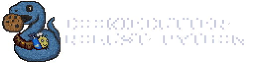

<h1 align="center">
  <a href="https://github.com/robust-python/cookiecutter-robust-python">
    
    <br>
  </a>
</h1>

<!-- badges-begin -->

[](https://robust-python.dev/cookiecutter)
[](https://github.com/astral-sh/uv)
[](https://github.com/robust-python/cookiecutter-robust-python)
[](https://github.com/robust-python/robust-python-demo/actions)
[](https://github.com/robust-python/robust-maturin-demo/actions)
[](https://discord.gg/XZAHSBgqXU)

<!-- badges-end -->

# cookiecutter-robust-python

**A template making robust design the default**

**[📚 View Documentation](https://cookiecutter-robust-python.readthedocs.io/)** | **[🐛 Report a Bug](https://github.com/robust-python/cookiecutter-robust-python/issues)** | **[✨ Request a Feature](https://github.com/robust-python/cookiecutter-robust-python/issues)**

---

## Quick Start

### Prerequisites
The only requirement is [uv].

### Create Your Project
Navigate to where you want to create your project and run:

```bash
uvx cruft create https://github.com/robust-python/cookiecutter-robust-python.git
```

This will prompt you for a few inputs to customize your project:
```
[1/15] project_name (robust-python): my-awesome-project
[2/15] package_name (my_awesome_project):
[3/15] friendly_name (My Awesome Project):
...
```

### Project Setup

After generating your project, set it up for development:

```bash
cd my-awesome-project

# Set up virtual environment and install dependencies
uvx nox -s setup-venv

# Initialize git repository with main/develop branches
uvx nox -s setup-git

# Set up remote repository (requires empty remote repo to exist)
uvx nox -s setup-remote
```

**Quick setup:** Run `uvx nox -t env` to execute all environment setup tasks at once.


## Most Notable Features
- Modern tooling with [uv], [ruff], [cruft], etc.
- Built for supporting most OS's (windows, linux, macos) and all currently supported [python] versions
- Platform agnostic CI/CD ([github], [gitlab], [bitbucket])
- CI/CD that parities local [nox] sessions for all [python]
- [maturin] support that can be added at any time during the project's lifecycle
- Designed to be a maintainable template over time through the use of automated demos and integration tests
- Rich documentation explaining tooling decisions and rationale

For a general overview of where we are at with this template, please see the [roadmap](#roadmap) section.

## Example Output
For an example of this template's output, please visit the [demo](https://github.com/robust-python/robust-python-demo) which is kept up to date with the current state of this template.

## Roadmap

This is a really brief/condensed idea of what is planned for this template, and where it stands currently:
<details>
<summary>Click to expand</summary>

- [x] Swap to UV, Ruff, and Basedpyright (maybe ty later, but at the moment of writing this wasn't ready yet)
- [x] Add cruft and commitizen
- [x] Centralize CI/CD through noxfile using uv cache to maintain speed
- [x] Add CI/CD for GitHub, Gitlab, and Bitbucket (Only GitHub guaranteed to work, but others should be close enough)
- [x] Add automated integration testing with separate repos to act as demos
- [x] Add release process for demo
- [x] Ensure end to end process for base python template works fully
- [ ] Ensure maturin template works locally
- [ ] Add modified CI/CD for the maturin version
- [ ] Add CI/CD for the cookiecutter itself
- [ ] Add github actions to automate demo publishing on merge to main or develop in cookiecutter
- [ ] Better define out templates for issues, pull requests, etc.
- [ ] Improve generated changelogs
- [ ] Clean up documentation and make it readable
- [ ] Possibly swap documentation to follow MADR (Maybe during clean up process, but low priority for the time being)
- [ ] Move to an organization (Will be done whenever there are other users besides myself)
- [ ] Add any missing automation for administrative tasks
- [ ] Designate backup plans for the projects lifecycle over time
</details>


# Why does this project exist?

Unfortunately, the [Hypermodern Python Cookiecutter] is no longer maintained nor modern.
While it will always have a place in my heart, there have been far too many improvements in Python tooling to keep using it as is.

For a while I maintained [a personal fork](https://github.com/56kyle/cookiecutter-hypermodern-python) that I would update, however, when it came time to switch
to new tooling such as [ruff], [uv], [maturin], etc., I found the process of updating the existing tooling to be extremely painful.

The [Hypermodern Python Cookiecutter] remains as a fantastic sendoff point for devs interested in building a 2021-style Python Package. However, there were
a handful of issues with it that prevented it from being able to adapt to new Python developments over the years.

# Okay, so what's different this time?

The [Robust Python Cookiecutter] exists to solve a few main concerns

- [Template Update Propagation](#template-update-propagation)
- [Project Domain Expansion](#project-domain-expansion)
- [Documenting Tooling Decisions](#documenting-tooling-decisions)
- [CI/CD Vendor Lock](#cicd-vendor-lock)
- [Project Neglect](#project-neglect)

## Template Update Propagation

One of the main issues I encountered with [my personal fork] of the [Hypermodern Python Cookiecutter] was that any change
I made to my repos would mean a later conflict if I tried to rerun [cookiecutter] to sync a change from a different project.

Thankfully, [cruft] exists specifically to help with this issue. It enables us to periodically create PR's to add in any fixes
the [Robust Python Cookiecutter] may have added.

Additionally, extra care is put in to use tooling specific config files whenever possible to help reduce merge conflicts occurring
in the pyproject.toml.

## Project Domain Expansion

Now, I'm not one to advocate for mixing languages in a project. However, there is a unique case that has arisen with the creation of [maturin].

There are a plethora of great projects such as [ruff], [uv], [polars], [just], etc. all making use of [maturin] to get the performance improvements of [rust] while
submitting their package to both pypi and crates.io

Now, this definitely is not required by any means to make a good Python package, however this pattern only seems to be picking up momentum and has honestly been a massive boon
to Python's ecosystem overall.

That being said, it's generally good practice to avoid the complexity of this dual language system unless you actually need the performance bump for your use case. However knowing ahead of time if performance
will be an issue is rather tricky, and a much easier route is to just prepare as though you _might_ swap to it some day.

The [Robust Python Cookiecutter] includes an `add_rust_extension` flag that not only toggles [maturin] vs a traditional Python package,
but that can be used in combination with [cruft] to swap to [maturin] at any time with just about no risk to CI/CD / etc.

Additionally, the [Robust Python Cookiecutter] is designed with both normal and [monorepos] in mind. So whether you need to just add
a quick [rust] module for performance or you are trying to publish a series of crates and packages, either case will be handled using a setup inspired by [polars].

## Documenting Tooling Decisions

One of the really stand out features of the [Hypermodern Python Cookiecutter] was its incredibly detailed documentation.
It did a pretty great job of describing the tooling to use, but there was a distinct lack of **_why_** these decisions were made.

It may seem like a small detail, but detailing why a decision was made has an incredibly important effect on the maintainablity of the template.

#### **It allows maintainers to check if a decision should change in one click.**

Rather than having to go through a mini crusade to determine whether we use [poetry] or [uv], we can just point to the
[existing reasoning](https://cookiecutter-robust-python.readthedocs.io/en/latest/topics/02_dependency_management.md#option-2--term--poetry) to see if it still is true or not.

Overall, it's rather rare that people debate over tooling for no reason. Most things have merit in some cases, and a large goal of this template is identifying the tools that have the most merit in almost all cases.

## CI/CD Vendor Lock

Now don't get me wrong, I love [github-actions] and do pretty much everything in my power to avoid [bitbucket-pipelines].
However, not all jobs have the luxury of GitHub, and I would love to be able to just use the same template for both my personal and professional projects.

The [Robust Python Cookiecutter] focuses on being as modular as possible for areas that connect to the CI/CD pipeline. Additionally, there will always be either alternative
CI/CD options or at a minimum basic examples of what the translated CI/CD pipeline would look like.

Finally, the main reason that this task is even possible is that the [Robust Python Cookiecutter] mirrors all of the CI/CD steps in it's local dev tooling.
The local [noxfile] is designed to match up directly with the CI/CD each step of the way.

The [Hypermodern Python Cookiecutter] did this where it could afford to also, however the lack of [uv] meant it would significantly increase CI/CD times if done everywhere.
Thankfully now we can spin up a venv with a tiny fraction of the overhead that used to exist.

## Project Neglect

This is most certainly not a knock against claudio. The work they did on [cookiecutter-hypermodern-python] laid the way for countless other devs to start
implementing best practices in their python packages.

However, Open Source work is draining, and is especially so for a project template including metacode.

I can guarantee that if the [Robust Python Cookiecutter] ever sees any number of users, I will immediately transfer it to an organization to enable at least a handful
of trusted individuals to ensure the project is taken care of.

[bitbucket]: https://bitbucket.org
[bitbucket-pipelines]: https://support.atlassian.com/bitbucket-cloud/docs/write-a-pipe-for-bitbucket-pipelines/
[cookiecutter]: https://cookiecutter.readthedocs.io/en/stable/
[cookiecutter-hypermodern-python]: https://github.com/cjolowicz/cookiecutter-hypermodern-python
[cookiecutter-robust-python]: https://github.com/robust-python/cookiecutter-robust-python
[cruft]: https://cruft.github.io/cruft/
[github]: https://github.com
[github-actions]: https://docs.github.com/en/actions
[gitlab]: https://gitlab.com
[hypermodern python cookiecutter]: https://github.com/cjolowicz/cookiecutter-hypermodern-python
[just]: https://github.com/casey/just?tab=readme-ov-fil
[maturin]: https://github.com/PyO3/maturin
[monorepos]: https://en.wikipedia.org/wiki/Monorepo
[my personal fork]: https://github.com/56kyle/cookiecutter-hypermodern-python
[nox]: https://nox.thea.codes/
[noxfile]: https://github.com/robust-python/cookiecutter-robust-python/blob/main/%7B%7Bcookiecutter.project_name%7D%7D/noxfile.py
[poetry]: https://python-poetry.org/docs/
[polars]: https://github.com/pola-rs/polars
[python]: https://www.python.org/
[robust python cookiecutter]: https://github.com/robust-python/cookiecutter-robust-python
[ruff]: https://docs.astral.sh/ruff/
[rust]: https://www.rust-lang.org/learn
[rye]: https://rye.astral.sh/
[install uv]: https://docs.astral.sh/uv/getting-started/installation/
[uv]: https://docs.astral.sh/uv/
